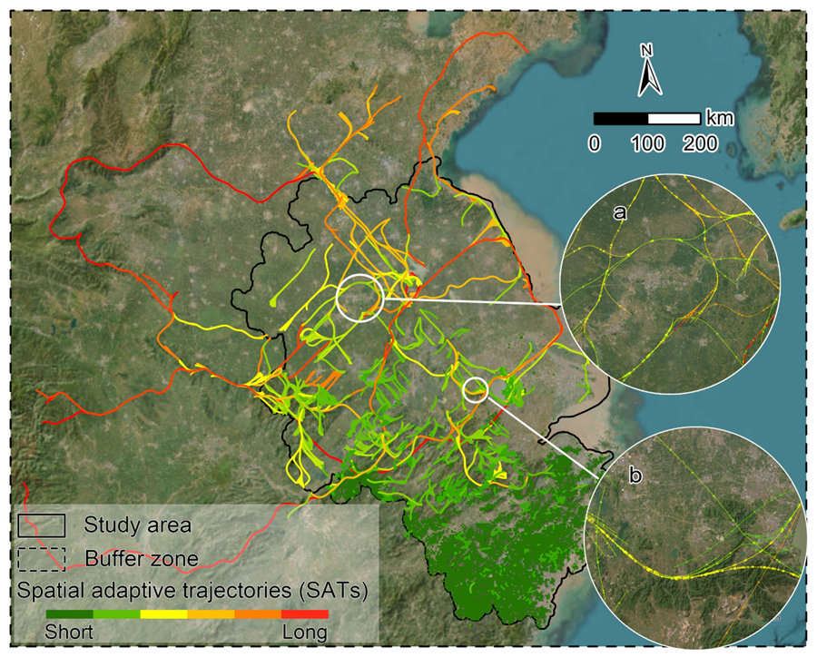

# __Dispersal__
A python tool for simulating species' spatial adaptive trajectory
### __example__
. 
## __Environment setup__
It is highly recommended to use __linux__ to set up the Python environment.
If windows, we reconmended __WLS2__ to set up the Python environment with   [__Graph-tool__](https://graph-tool.skewed.de/static/docs/stable/index.html "see Graph-tool")

Here is an example to build Python envirment when using Conda   

    conda create --name gt -c conda-forge graph-tool
    conda activate gt

activate enviroment gt   

    conda activate gt  

## __Data peocessing__  🥹
### Informations about how to format the data.
Three types of geographic grid data:
1. Resistance surface to species movement
2. Study area (landscape or patches)
3. species’ niche (e.g., temperature, precipitation, land use, etc.,)__continuous or type variable

Requirments for geo datasets:😘
1. same format (tiff)
2. same projected coordinate system
3. same number of rows and columns

😉 How to list information of geodata in __geo_list_information.csv__ as example:

| name | path | is_niche_variable | compare_to_future | similarity_for_variable |priority_for_niche | essential_for_niche |
| ----------- | ----------- |------- |------- | -------|------- |------- | 
| study_area | ./example/study_area.tif |FALSE|FALSE|
| NO_patch | ./example/protect_area.tif|FALSE|FALSE|
|R|	./example/resistance.tif|	TRUE|	FALSE|	 ["-inf", 0]|	5|	FALSE|
|landuse|	./example/landuse.tif|	TRUE|	FALSE|	[21, 22, 23,24,31,32,33]|	1|	TRUE|
|c_con1|	./example/current_PCA1.tif|	TRUE|	f_con1|	[-0.4, 0.4]|	2|	TRUE|
|c_con2|	./example/current_PCA2.tif|	TRUE|	f_con2|	[-0.8, 0.8]|	3|	FALSE|
|c_con3|	./example/current_PCA3.tif|	TRUE|	f_con3|	[-1.2, 1.2]|	4|	TRUE|
|f_con1|	./example/future_PCA1.tif|	TRUE|	FALSE	|		
|f_con2|	./example/future_PCA2.tif|	TRUE|	FALSE	|		
|f_con3|	./example/future_PCA3.tif|	TRUE|	FALS    |			

### Use the following code to automatically generate the table demo as shown above.  

    from Dispersal import sat_preprocess
    # use function 'sat_preprocess' firstly to generate the table demo as a CSV format.
    sat_preprocess(work_dir)

### columns explaintions:
1. __name__ : define a name for raster of geodata. It should be a text.  
2. __path__ : path of raster file.   Relative path or absolute path.   
3. __is_niche_variable__ : Is it one of the variables defining ecological niche, TRUE or FALSE.  
4. __compare_to_future__ : Is this ecological niche variable compared to the same variable in the future? If no, input "FALSE", If yes, input the "name" that appeared in the first column.  
5. __similarity_for_variable__ :  Define the conditions for variable similarity. here:  
    A list of two numerical elements representing similar intervals for Continuous variable. e.g. [-1,1] represents "15 ℃ similar to 15 ℃ ± 1℃". ['-inf',1] represents "< 1", [1,'inf'] represents "> 1".  
    A list of one or multiple numerical elements representing similar values for Categorical variable . e.g. [21, 22, 23,24,31,32,33] represents 7 different types of land use.  
6. __priority_for_niche__ : Priority of variables defining ecological niche,  1 represents the highest priority, followed by 2 , 3...
7. __essential_for_niche__ :  Is this variable necessary for defining ecological niche? TRUE or FALSE.

### Tips: Directly use Excel to edit this CSV table and fill in the informations of ecological niche raster.
😉 How to setup parameters in  __configs.json__ as example:
    This json demo can be also automatically generated by thr function "sat_preprocess(work_dir)" when it was used for the first time.  
### configs.json   

    {
        "work_dir": work_dir,
        "Geo_dataset_list": CSV_FILE,
        "study_area": ["name"],
        "resistance_raster": "example_path",
        "neighbors": 8,
        "num_of_optimal_SATs": 1
    }
### parameters explaintions:
1. __work_dir__ : project folder path, not change it.
2. __geo_dataset_list__ : the path of "Geo_dataset_list.csv", not change it.
3. __study_area__ : List the names that appeared in the "Geo_dataset_list.csv", a list, e.g, ["study_area","NO_patch"]  
4. __resistance_raster__ : names that appeared in the "Geo_dataset_list.csv", e.g, "R"
5. __neighbors"__ : grid cell neighbors, 4 or 8, defaulted 8.
5. __num_of_optimal_SATs__ : number of optimal SATS for each grid cell (unit, or pixel).

### Tips: Directly use Notepad on computer to edit this Json file and edit parameters.  

## __SATs identification__  🥹  
Once we finished 
    from Dispersal import sat_identify
    # Search the destination on the graph object, and identify spatial adaptive trajectories
    sat_identify (work_dir, set_segs = None, start_seg = None)

